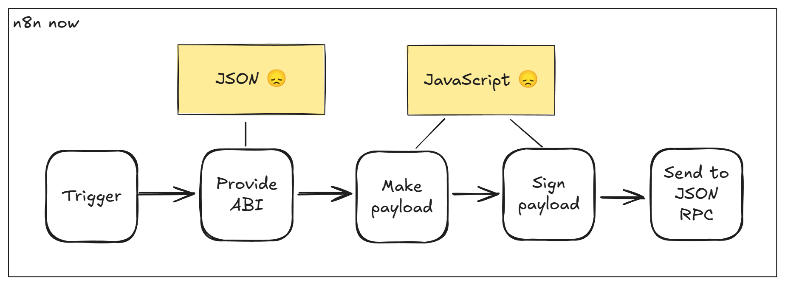
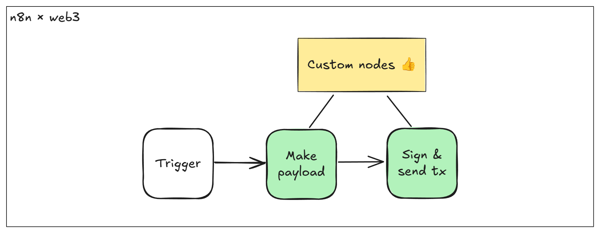

# n8n-nodes-web3

**n8n × web3** is a collection of custom nodes built for n8n, the popular open-source no-code workflow automation tool.

[n8n](https://n8n.io/) is a [fair-code licensed](https://docs.n8n.io/reference/license/) workflow automation platform.

## Installation

The community package name is `@majus/n8n-nodes-web3`.

Follow the [installation guide](https://docs.n8n.io/integrations/community-nodes/installation/) in the n8n community nodes documentation.

## Motivation

While n8n is fantastic for automating tasks without needing to code, it doesn’t currently support blockchain integrations.

That’s where we come in! Our project adds seamless web3 functionalities, making it easy for anyone to interact with various blockchain protocols right within n8n.

There are many clear evidences that web3 integration is demanded by no-code developers community:

- [Need a node to read onchain data](https://community.n8n.io/t/need-a-node-to-read-onchain-data-blockchain-web3/30893)
- [Looking for a freelance for web3 script](https://community.n8n.io/t/looking-for-a-freelance-for-web3-script/54251)
- [How to automate Stripe to Web3 smart contracts?](https://community.n8n.io/t/how-to-automate-stripe-to-web3-smart-contracts/19805)
- [External crypto packages not working, others do](https://community.n8n.io/t/external-crypto-packages-not-working-others-do/34850)
- [Connecting with Farcaster (social media protocol)](https://community.n8n.io/t/connecting-with-farcaster-social-media-protocol/68412)
- [Looking for a Blockchain-Based Data Node—Or Should I Build One?](https://community.n8n.io/t/looking-for-a-blockchain-based-data-node-or-should-i-build-one/79008)
- [N8n Blockchain/Web3 connectors needed?](https://community.n8n.io/t/n8n-blockchain-web3-connectors-needed/26899)
- [I Created a Solana Node for n8n](https://community.n8n.io/t/i-created-a-solana-node-for-n8n/91289)
- [Add ECDSA algorithm to Crypto Node](https://community.n8n.io/t/add-ecdsa-algorithm-to-crypto-node/12228)
- [Node for Interfacing with JsonRPC](https://community.n8n.io/t/node-for-interfacing-with-jsonrpc/5284)

## Operations

With **n8n × web3**, no-code developers can effortlessly add blockchain features to their workflows. Plus, pro web3 developers can quickly prototype their decentralized apps and blockchain solutions without the hassle.

Currently, there are following custom nodes available:

- "Farcaster: Frame builder" — allows to build [Farcaster frames standard](https://docs.farcaster.xyz/developers/frames/) compliant HTML markup.
- "Farcaster: Transaction builder" — simplifies creating [Farcaster frames standard](https://docs.farcaster.xyz/developers/frames/) compliant transaction request data.
- "Lilypad Generic Job" — allows to issue generic job to the [Lilypad](https://lilypad.tech/) TEE.
- "Lilypad Llama3 Job" — allows to issue Llama3 specific job to the [Lilypad](https://lilypad.tech/) TEE.
- "Squid Router" — allows to perform token swaps between different blockchains via the [Squid Router](https://www.squidrouter.com/) API.
- "Flow Mutate" — allows to perform the [Flow blockchain](https://flow.com) write operations via FVM.
- "Flow Query" — allows to perform the [Flow blockchain](https://flow.com) read operations via FVM.

<!-- ## Credentials

_If users need to authenticate with the app/service, provide details here. You should include prerequisites (such as signing up with the service), available authentication methods, and how to set them up._ -->

<!-- ## Compatibility

_State the minimum n8n version, as well as which versions you test against. You can also include any known version incompatibility issues._ -->

<!-- ## Usage

_This is an optional section. Use it to help users with any difficult or confusing aspects of the node._

_By the time users are looking for community nodes, they probably already know n8n basics. But if you expect new users, you can link to the [Try it out](https://docs.n8n.io/try-it-out/) documentation to help them get started._ -->

## Examples

### Farcaster tip

Allow users to make a small tip in ETH to any address via Farcaster.

Custom nodes used: Farcaster Frame builder, Farcaster Tx Builder.

How to use:

1. Create a new empty workflow.
1. Import `examples/farcaster-tip.json` into the workflow.
1. Activate the workflow.
1. Copy "Production URL" from the "Webhook" trigger node.
1. Post this link on Farcaster and test it!

[Screencast from 2025-04-01 22-10-49.webm](https://github.com/user-attachments/assets/557dd305-c0e8-40c7-ba25-e29b93b7f6c2)

### Squid route

Fetch tokens supported by Squid, find out USDT address on BNB chain and USDC address on Arbitrum and get a swap route for these.

Custom nodes used: Squid Router.

How to use:

1. Create a new empty workflow.
1. Import `examples/squid-route.json`.
1. Double-click on each of the Squid nodes and choose Squid API access credentials (obtain one [here](https://squidrouter.typeform.com/integrator-id)).
1. Execute the workflow manually.
1. Double-click on the rightmost node and check the route data.

[Screencast from 2025-04-02 15-08-04.webm](https://github.com/user-attachments/assets/c5f70fd8-20c4-4ada-a840-d6316be31123)

### Flow balances (FLIX)

Fetch all token balances for a Flow account using FLIX template.

Custom nodes used: Flow Query.

How to use:

1. Create a new empty worflow.
1. Import `examples/flow-flix-balances.json`.
1. Double-click on the Flow Query node and choose the Flow FVM account credentials, or create one using account address, key index and a private key.
1. Execute the workflow manually.
1. Double-click on the rightmost node and check the account balances.

[Screencast from 2025-04-02 15-45-07.webm](https://github.com/user-attachments/assets/f0909f80-1a19-4063-9747-a1ffe4eec23c)

## Roadmap

We plan for our future custom nodes handle common blockchain tasks like:

- Converting data between JavaScript and Solidity
- Signing data with ECDSA
- Sending raw transactions via JSON RPC
- Automatically generating transaction data from Smart Contract ABIs
- Using standard Smart Contract ABIs without any coding
- Listening for blockchain events to trigger workflows

Down the road, we’d love to expand even more—think support for non-EVM blockchains like Bitcoin and Solana, or adding tools for working directly with Solidity and managing ZK proofs.

Eventually, we aim to have our nodes integrated into n8n’s core, joining the existing ~200 web2 service nodes and making blockchain automation a breeze for everyone.

## Resources

- [n8n community nodes documentation](https://docs.n8n.io/integrations/community-nodes/)
<!-- * _Link to app/service documentation._ -->

<!-- ## Version history

_This is another optional section. If your node has multiple versions, include a short description of available versions and what changed, as well as any compatibility impact._ -->

## Licence

[MIT](./LICENSE.md)
