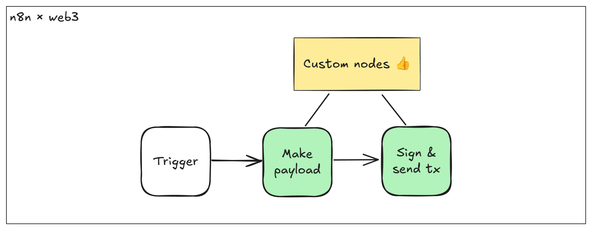

# n8n-nodes-web3

**n8n × web** is a collection of custom nodes built for n8n, the popular open-source no-code workflow automation tool.

[n8n](https://n8n.io/) is a [fair-code licensed](https://docs.n8n.io/reference/license/) workflow automation platform.

## Installation

Follow the [installation guide](https://docs.n8n.io/integrations/community-nodes/installation/) in the n8n community nodes documentation.

## Motivation

While n8n is fantastic for automating tasks without needing to code, it doesn’t currently support blockchain integrations.

That’s where we come in! Our project adds seamless web3 functionalities, making it easy for anyone to interact with various blockchain protocols right within n8n.

## Operations

With **n8n × web3**, no-code developers can effortlessly add blockchain features to their workflows. Plus, pro web3 developers can quickly prototype their decentralized apps and blockchain solutions without the hassle. Our custom nodes handle common blockchain tasks like:

- Converting data between JavaScript and Solidity
- Signing data with ECDSA
- Sending raw transactions via JSON RPC
- Automatically generating transaction data from Smart Contract ABIs
- Using standard Smart Contract ABIs without any coding
- Listening for blockchain events to trigger workflows

<!-- ## Credentials

_If users need to authenticate with the app/service, provide details here. You should include prerequisites (such as signing up with the service), available authentication methods, and how to set them up._ -->

<!-- ## Compatibility

_State the minimum n8n version, as well as which versions you test against. You can also include any known version incompatibility issues._ -->

<!-- ## Usage

_This is an optional section. Use it to help users with any difficult or confusing aspects of the node._

_By the time users are looking for community nodes, they probably already know n8n basics. But if you expect new users, you can link to the [Try it out](https://docs.n8n.io/try-it-out/) documentation to help them get started._ -->

## Roadmap

Down the road, we’d love to expand even more—think support for non-EVM blockchains like Bitcoin, Solana, and Flow, or adding tools for working directly with Solidity and managing ZK proofs. Eventually, we aim to have these nodes integrated into n8n’s core, joining the existing ~200 web2 service nodes and making blockchain automation a breeze for everyone.

## Resources

* [n8n community nodes documentation](https://docs.n8n.io/integrations/community-nodes/)
<!-- * _Link to app/service documentation._ -->

<!-- ## Version history

_This is another optional section. If your node has multiple versions, include a short description of available versions and what changed, as well as any compatibility impact._ -->

## Licence 

[MIT](./LICENSE.md)